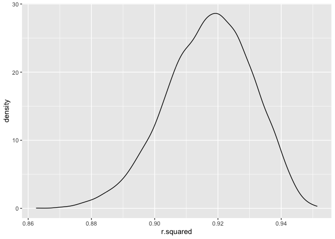
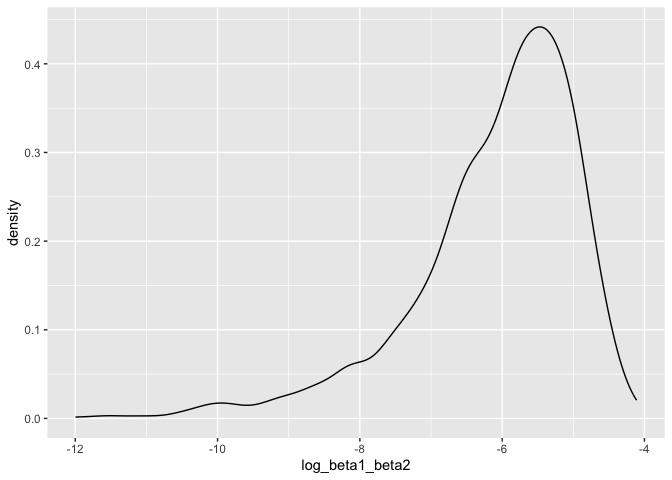
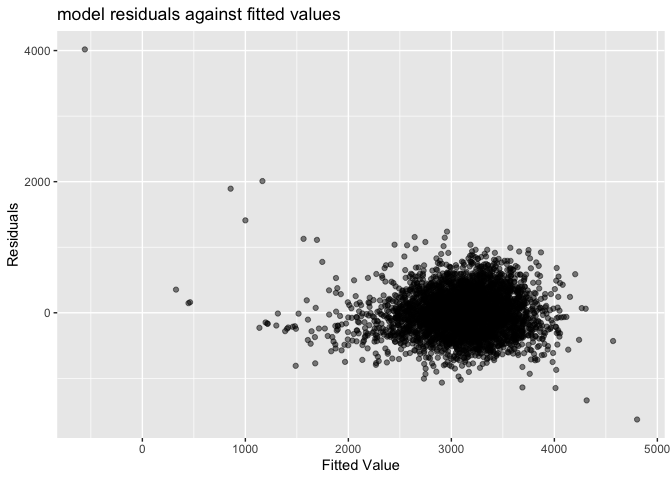
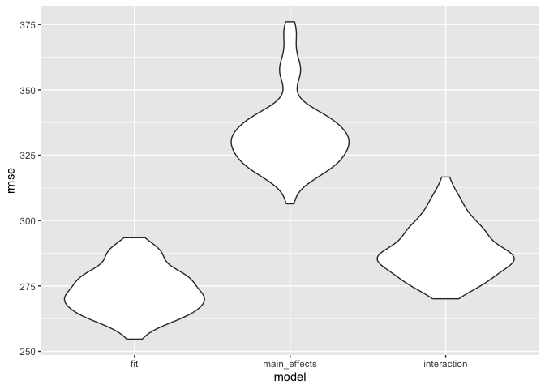

p8105_hw6_qs2261
================
Qinting Shen
2023-11-27

## Problem 2

### Load theCentral Park weather data

``` r
weather_df = 
  rnoaa::meteo_pull_monitors(
    c("USW00094728"),
    var = c("PRCP", "TMIN", "TMAX"), 
    date_min = "2022-01-01",
    date_max = "2022-12-31") |>
  mutate(
    name = recode(id, USW00094728 = "CentralPark_NY"),
    tmin = tmin / 10,
    tmax = tmax / 10) |>
  select(name, id, everything())
```

    ## using cached file: /Users/momo/Library/Caches/org.R-project.R/R/rnoaa/noaa_ghcnd/USW00094728.dly

    ## date created (size, mb): 2023-09-28 10:20:31.783753 (8.524)

    ## file min/max dates: 1869-01-01 / 2023-09-30

### bootstrap

produce estimates of r̂ 2 and log(β̂ 1∗β̂ 2)

``` r
r_square =
  bootstrap(weather_df, 5000, id = "strap_number") |> 
  mutate(
    models = map(.x = strap, ~lm(tmax ~ tmin + prcp, data = .x)),
    results = map(models, broom::glance)
  ) |> 
  select(strap_number, results) |> 
  unnest(results) |> 
  select(strap_number, r.squared)

log_beta = 
  bootstrap(weather_df, 5000, id = "strap_number") |> 
  mutate(
    models = map(.x = strap, ~lm(tmax ~ tmin + prcp, data = .x)),
    results = map(models, broom::tidy)
  ) |> 
  select(strap_number, results) |> 
  unnest(results) |> 
  select(strap_number, term, estimate) |> 
  pivot_wider(
    names_from = term,
    values_from = estimate
  ) |> 
  mutate(
    log_beta1_beta2 = log(tmin*prcp)
  )
```

    ## Warning: There was 1 warning in `mutate()`.
    ## ℹ In argument: `log_beta1_beta2 = log(tmin * prcp)`.
    ## Caused by warning in `log()`:
    ## ! NaNs produced

- There are many estimates of prcp is negative, so we get many NAs when
  calculating the log(beta1\*beta2).

Plot the distribution of `r.squared`, and describe these in words.

``` r
r_square |> 
  ggplot(aes(x = r.squared))+
  geom_density()
```

<!-- -->

- r_square: the distribution of r_square under repeated strap is a
  little left skewed, the majority of the r square value is between 0.88
  and 0.94, and the peak is around 0.918.

Plot the distribution of `log_beta1_beta2`, and describe these in words.

``` r
log_beta |> 
  ggplot(aes(x = log_beta1_beta2))+
  geom_density()
```

    ## Warning: Removed 3383 rows containing non-finite values (`stat_density()`).

<!-- -->

- log_beta: Since we get many NAs when calculating the
  log(beta1\*beta2), we removed many rows in this distribution plot. The
  distribution of log_beta under repeated strap is left skewed, and the
  majority estimates of the log_beta are between -8 and -4.5, and the
  peak is around -5.

Compute 95% CI

``` r
r_square_sum =
  r_square |> 
  summarize(
    ci_lower = quantile(r.squared, 0.025),
    ci_upper = quantile(r.squared, 0.975)
  )

log_beta_sum =
  log_beta |> 
  summarize(
    ci_lower = quantile(log_beta1_beta2, 0.025, na.rm = TRUE),
    ci_upper = quantile(log_beta1_beta2, 0.975, na.rm = TRUE)
  )
```

The 95% CI for R squared is from 0.8898596 to -4.5687042.

The 95% CI for log_beta1_beta2 is from -9.2914709 to -4.5687042.

## Problem 3

### Load and clean the data for regression analysis

Import data

``` r
birthweight_raw = 
  read_csv(file = 'birthweight.csv')
```

    ## Rows: 4342 Columns: 20
    ## ── Column specification ────────────────────────────────────────────────────────
    ## Delimiter: ","
    ## dbl (20): babysex, bhead, blength, bwt, delwt, fincome, frace, gaweeks, malf...
    ## 
    ## ℹ Use `spec()` to retrieve the full column specification for this data.
    ## ℹ Specify the column types or set `show_col_types = FALSE` to quiet this message.

Clean data

``` r
birthweight_df = 
  birthweight_raw|> 
  mutate(
    babysex = as.factor(babysex),
    frace = as.factor(frace),
    malform = as.factor(malform),
    mrace = as.factor(mrace)
    ) |> 
  drop_na()
```

### Propose a regression model for birthweight

- From my understanding, birthweight may be affected by baby’s sex,
  baby’s length at birth, mother’s weight at delivery, gestational age
  in weeks, presence of malformations that could affect weight, mother’s
  weight gain during pregnancy. In this case, I decide to choose
  `babysex` `blength` `delwt` `gaweeks` `malform` `wtgain` as predictors
  to predict birth weight, and fit the data to a multiple linear
  regression model.

``` r
fit = lm(bwt ~babysex + blength + delwt + gaweeks + malform + menarche +  wtgain, data = birthweight_df) 

broom::glance(fit)
```

    ## # A tibble: 1 × 12
    ##   r.squared adj.r.squared sigma statistic p.value    df  logLik    AIC    BIC
    ##       <dbl>         <dbl> <dbl>     <dbl>   <dbl> <dbl>   <dbl>  <dbl>  <dbl>
    ## 1     0.593         0.592  327.      902.       0     7 -31297. 62612. 62670.
    ## # ℹ 3 more variables: deviance <dbl>, df.residual <int>, nobs <int>

``` r
broom::tidy(fit)
```

    ## # A tibble: 8 × 5
    ##   term          estimate std.error statistic   p.value
    ##   <chr>            <dbl>     <dbl>     <dbl>     <dbl>
    ## 1 (Intercept) -4365.       108.    -40.3     2.44e-301
    ## 2 babysex2      -18.1       10.0    -1.81    7.01e-  2
    ## 3 blength       123.         2.01   60.9     0        
    ## 4 delwt           2.16       0.251   8.59    1.20e- 17
    ## 5 gaweeks        25.6        1.70   15.1     2.35e- 50
    ## 6 malform1       41.6       84.6     0.491   6.23e-  1
    ## 7 menarche       -0.0101     3.37   -0.00300 9.98e-  1
    ## 8 wtgain          2.75       0.506   5.43    5.82e-  8

### Diagnostics

``` r
birthweight_df |> 
  modelr::add_predictions(fit) |> 
  modelr::add_residuals(fit) |> 
  ggplot(aes(x = pred, y = resid)) +
  geom_point() +
  labs(
    title = "model residuals against fitted values ", 
    x = ("Fitted Value"),
    y = ("Residuals")
    )
```

<!-- -->

- The pattern of scatter plot between predictions and residuals is not
  random, and in a cluster, which means this model does not meet the
  assumption of linear regression model.

### Compare my model to two others:

One using length at birth and gestational age as predictors (main
effects only)

``` r
main_effects = lm(bwt ~ blength + gaweeks ,
             data = birthweight_df) 

broom::glance(main_effects)
```

    ## # A tibble: 1 × 12
    ##   r.squared adj.r.squared sigma statistic p.value    df  logLik    AIC    BIC
    ##       <dbl>         <dbl> <dbl>     <dbl>   <dbl> <dbl>   <dbl>  <dbl>  <dbl>
    ## 1     0.577         0.577  333.     2958.       0     2 -31381. 62771. 62796.
    ## # ℹ 3 more variables: deviance <dbl>, df.residual <int>, nobs <int>

``` r
broom::tidy(main_effects)
```

    ## # A tibble: 3 × 5
    ##   term        estimate std.error statistic  p.value
    ##   <chr>          <dbl>     <dbl>     <dbl>    <dbl>
    ## 1 (Intercept)  -4348.      98.0      -44.4 0       
    ## 2 blength        129.       1.99      64.6 0       
    ## 3 gaweeks         27.0      1.72      15.7 2.36e-54

``` r
anova(main_effects, fit) |> 
  broom::tidy()
```

    ## # A tibble: 2 × 7
    ##   term                      df.residual    rss    df   sumsq statistic   p.value
    ##   <chr>                           <dbl>  <dbl> <dbl>   <dbl>     <dbl>     <dbl>
    ## 1 bwt ~ blength + gaweeks          4339 4.82e8    NA NA           NA   NA       
    ## 2 bwt ~ babysex + blength …        4334 4.63e8     5  1.83e7      34.3  1.88e-34

One using head circumference, length, sex, and all interactions
(including the three-way interaction) between these

``` r
three_way = lm(bwt ~ bhead * blength * babysex ,
             data = birthweight_df) 

broom::glance(three_way)
```

    ## # A tibble: 1 × 12
    ##   r.squared adj.r.squared sigma statistic p.value    df  logLik    AIC    BIC
    ##       <dbl>         <dbl> <dbl>     <dbl>   <dbl> <dbl>   <dbl>  <dbl>  <dbl>
    ## 1     0.685         0.684  288.     1346.       0     7 -30742. 61501. 61559.
    ## # ℹ 3 more variables: deviance <dbl>, df.residual <int>, nobs <int>

``` r
broom::tidy(three_way)
```

    ## # A tibble: 8 × 5
    ##   term                    estimate std.error statistic      p.value
    ##   <chr>                      <dbl>     <dbl>     <dbl>        <dbl>
    ## 1 (Intercept)            -7177.     1265.       -5.67  0.0000000149
    ## 2 bhead                    182.       38.1       4.78  0.00000184  
    ## 3 blength                  102.       26.2       3.90  0.0000992   
    ## 4 babysex2                6375.     1678.        3.80  0.000147    
    ## 5 bhead:blength             -0.554     0.780    -0.710 0.478       
    ## 6 bhead:babysex2          -198.       51.1      -3.88  0.000105    
    ## 7 blength:babysex2        -124.       35.1      -3.52  0.000429    
    ## 8 bhead:blength:babysex2     3.88      1.06      3.67  0.000245

``` r
anova(three_way, fit) |> 
  broom::tidy()
```

    ## # A tibble: 2 × 7
    ##   term                        df.residual    rss    df   sumsq statistic p.value
    ##   <chr>                             <dbl>  <dbl> <dbl>   <dbl>     <dbl>   <dbl>
    ## 1 bwt ~ bhead * blength * ba…        4334 3.59e8    NA NA             NA      NA
    ## 2 bwt ~ babysex + blength + …        4334 4.63e8     0 -1.05e8        NA      NA

### Cross-validate

``` r
cv_df_compare = 
  crossv_mc(birthweight_df, 100)
```

``` r
cv_df = 
  cv_df_compare |> 
  mutate(
    train = map(train, as_tibble),
    test = map(test, as_tibble)
  ) |> 
  mutate(
    fit_mod = map(.x = train, ~lm(bwt ~babysex + bhead + blength + delwt + fincome + frace +gaweeks + malform + menarche + mheight + momage + mrace + parity + pnumlbw + pnumsga + ppbmi + ppwt + smoken + wtgain, data = .x)),
    main_effects_mod = map(.x = train, ~lm(bwt ~ blength + gaweeks, data = .x)),
    interaction_mod = map(.x = train, ~lm(bwt ~ bhead * blength * babysex, data = .x))
  ) |> 
    mutate(
    rmse_fit = map2_dbl(.x = fit_mod, .y = test, ~rmse(model = .x, data = .y)),
    rmse_main_effects = map2_dbl(.x = main_effects_mod, .y = test, ~rmse(model = .x, data = .y)),
    rmse_interaction = map2_dbl(.x = interaction_mod, .y = test, ~rmse(model = .x, data = .y))
    ) |> 
  select(-fit_mod, -main_effects_mod, -interaction_mod)
```

compare RMSE

``` r
cv_df |> 
  select(starts_with("rmse")) |> 
  pivot_longer(
    everything(),
    names_to = "model", 
    values_to = "rmse",
    names_prefix = "rmse_") |> 
  mutate(model = fct_inorder(model)) |> 
  ggplot(aes(x = model, y = rmse)) + geom_violin()
```

<!-- -->

- By looking at the violin plot, I found the RMSE in my model is
  smallest, followed by interaction model.

- It might be better to use my model to evaluate the factors associated
  with birthweight since my model have the smallest RMSE, which
  indicates that my model fits the data better than the other two
  models.

- Additionally, the difference of RMSE between interaction model and my
  model is not that big. Therefore, I think interaction model also works
  well here.
